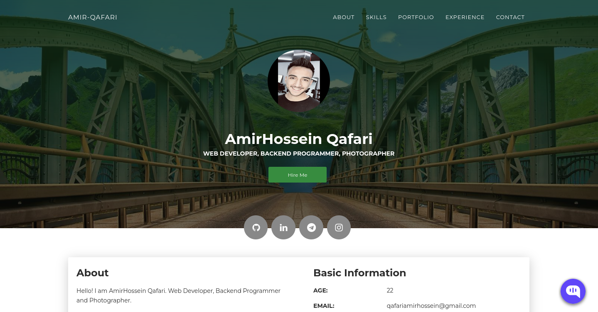
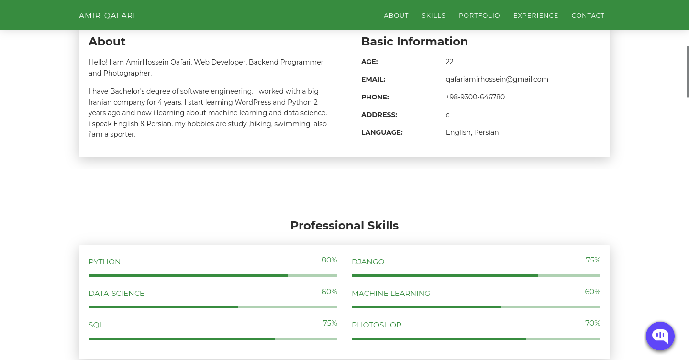
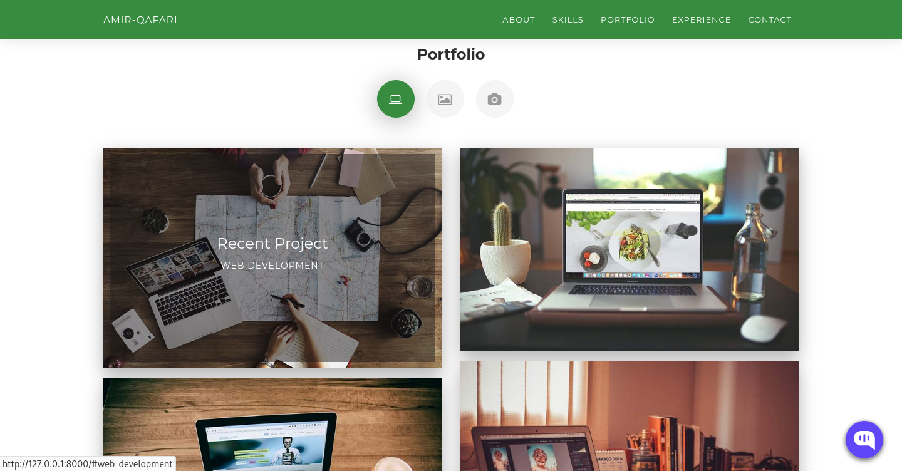
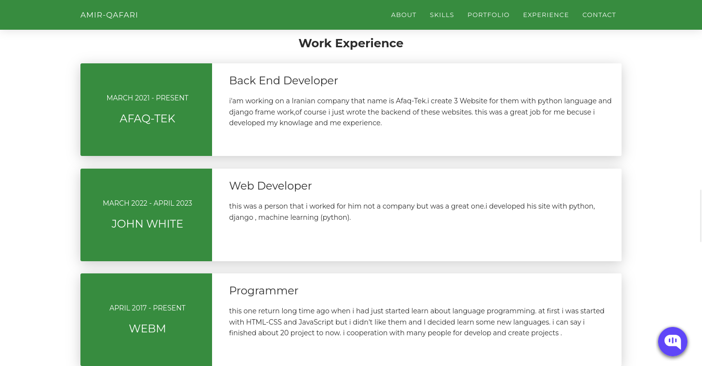
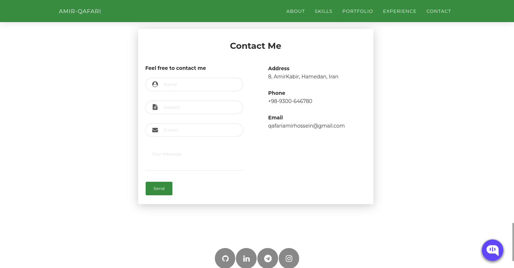

# Amir Qafari Personal Resume Website

This is a personal website and portfolio for AmirHossein Qafari, built with Django. It showcases professional skills, experience, portfolio projects, and provides a contact form for visitors. The site also features a simple chat page for guest interaction.

## Features
- **About**: Introduction and background information
- **Skills**: Professional and technical skills
- **Portfolio**: Showcases web, graphic, and photography projects
- **Experience**: Work and education history
- **Contact**: Visitors can send messages via a contact form
- **Chat**: Simple guestbook/chat page for visitors

## Tech Stack
- Python 3
- Django 4.2
- Bootstrap (frontend)

## Screenshots

Here are some screenshots of the website:







## Getting Started
1. Install dependencies:
   ```bash
   pip install -r requirements.txt
   ```
2. Run migrations:
   ```bash
   python manage.py migrate
   ```
3. Start the development server:
   ```bash
   python manage.py runserver
   ```
4. Visit [http://localhost:8000](http://localhost:8000) in your browser.

## License
See [LICENSE](LICENSE) for details.
 

